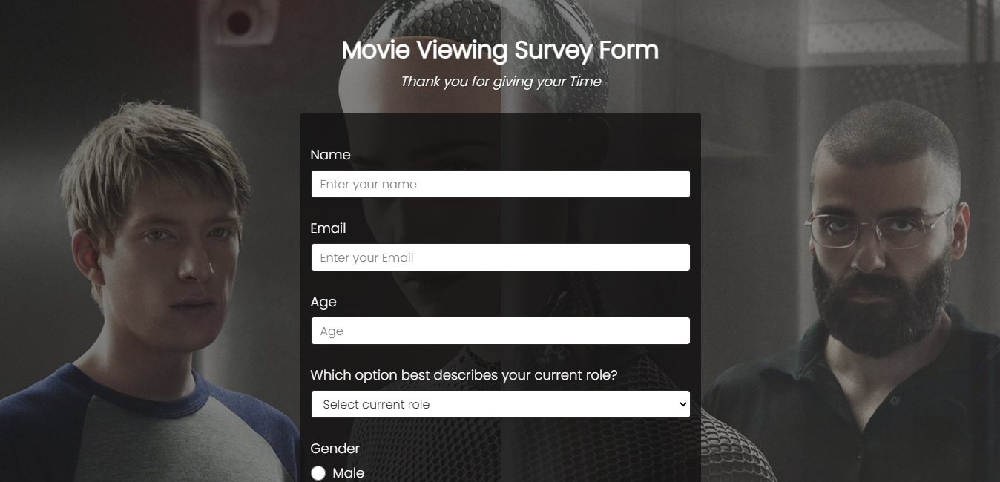

# Survey-Form

Forms are always an essential part of any project that is used to collect user input information.
<br>
In this article, I have created a <b>Movie Viewing</b> survey form using HTML and CSS.
<br>
<br>


## Getting Started

Start by cloning the repo : 
```sh
git clone https://github.com/dishantagg24/Survey-Form.git
```
Or Download and extract the zip file.
### Prerequisites

* A modern-web browser like Brave , Chrome , Firefox etc
* Computer..
* At last, Just you and your will....


### Running

1. Double-Click on index.html file or Open it with your favourite browser.

## Built With

* [HTML](https://www.html.com/) - Standard markup language
* [CSS](https://css.com) - Style sheet language

## Authors

* **[Dishant Aggarwal](https://github.com/dishantagg24)**
